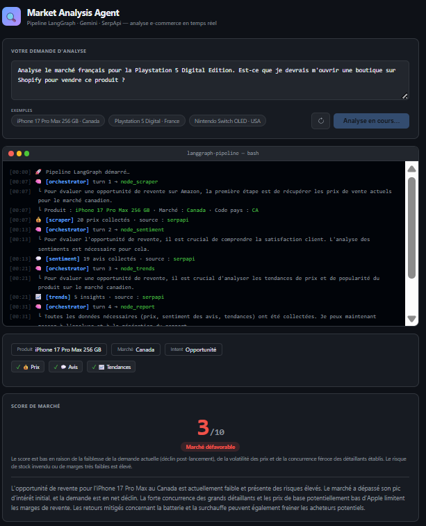

# Market Analysis Agent

Agent d'analyse de marché e-commerce piloté par un prompt libre.
L'agent extrait le produit et le marché, choisit ses outils, et produit un rapport stratégique.

---

## Architecture

```
POST /analyze { "prompt": "..." }
        │
        ▼
┌──────────────────────────────────────────────────┐
│              LangGraph Pipeline                  │
│                                                  │
│  node_orchestrator  <- Gemini                    │
│    │  extrait product/market depuis le prompt    │
│    │  décide quel tool appeler                   │
│    │  évalue après chaque appel                  │
│    │                                             │
│    ├──► outil 1: node_scraper (prix)             │
│    │         └──► node_orchestrator              │
│    │                                             │
│    ├──► outil 2: node_sentiment (avis clients)   │
│    │         └──► node_orchestrator              │
│    │                                             │
│    ├──► outil 3: node_trends (tendances)         │
│    │         └──► node_orchestrator              │
│    │                                             │
│    └──► outil 4: node_report (Gemini) --> END    │
└──────────────────────────────────────────────────┘
        │
        ▼
    JSON Report
```

**Pattern :**
À chaque tour, `node_orchestrator` évalue les données disponibles et décide quoi faire ensuite. Il boucle jusqu'à avoir assez de données, puis route vers `node_report`. Maximum `MAX_TURNS` tours (défaut : 6, configurable dans `.env`).

**Fallback automatique :** si une API est indisponible, le mock correspondant prend le relais. La requête ne fail jamais.

**Pourquoi LangGraph ?**

J'ai besoin d'une solution modulable où chaque composant a une responsabilité claire et peut évoluer indépendamment. LangGraph offre trois avantages concrets pour ce projet : l'AgentState donne une mémoire persistante au LLM entre chaque appel d'outil, les liens entre les nodes sont déclarés explicitement ce qui rend le flux lisible d'un coup d'oeil. Changer de modèle ne touche pas à la logique d'orchestration.
CrewAI et AutoGen sont pensés pour la collaboration entre plusieurs agents qui se parlent. Notre besoin est différent : un seul orchestrateur qui boucle sur ses propres outils. Ce pattern est plus naturel dans LangGraph. Google ADK est encore jeune et optimisé pour l'écosystème Google Cloud, ce qui introduit une dépendance inutile pour ce projet.
Une implémentation native en Python aurait été possible, mais elle aurait nécessité de recoder la gestion d'état entre les tours, le routing conditionnel et la protection contre les boucles infinies. Ce sont des problèmes déjà résolus par le framework LangGraph.

---

## Fichiers

```
langgraph-ecommerce-analysis/
├── app/
│   ├── config.py        # Variables d'environnement (os.getenv + .env)
│   ├── tools.py         # Collecte données : SerpApi + mocks
│   ├── fallbacks.py     # Fonctions de fallback rule-based
│   ├── nodes.py         # Les 5 nodes LangGraph (logique métier)
│   ├── agent.py         # Câblage du graphe + run_analysis()
│   └── main.py          # API FastAPI (routes + SSE streaming)
├── test/
│   ├── test_tools.py    # Tests des outils de collecte
│   ├── test_nodes.py    # Tests des nodes individuellement
│   ├── test_pipeline.py # Tests du pipeline complet
│   └── test_api.py      # Tests des routes HTTP
├── index.html           # Interface utilisateur (SSE streaming)
├── .env.example
├── Dockerfile
├── docker-compose.yml
└── requirements.txt
```

**Séparation des responsabilités :**

| Fichier | Responsabilité |
|---|---|
| `config.py` | Lire l'environnement |
| `tools.py` | Appeler les APIs externes |
| `fallbacks.py` | Logique rule-based quand les APIs ne fonctionnent pas |
| `nodes.py` | Logique de chaque node LangGraph |
| `agent.py` | Câblage du graphe LangGraph |
| `main.py` | Exposer l'API REST + SSE streaming |

---

## Installation

### Étape 1 - Cloner et configurer

```bash
git clone https://github.com/WAZOH/langgraph-ecommerce-analysis.git
cd langgraph-ecommerce-analysis
cp .env.example .env
# Remplir les clés API dans .env
```

### Étape 2 - Lancer avec Docker

S'assurer que Docker Desktop est lancé. Si non installé, télécharger sur [docker.com/products/docker-desktop](https://www.docker.com/products/docker-desktop).

```bash
docker compose up --build
```

### Étape 3 - Utiliser l'API

Il y a 3 manières d'utiliser l'app :

1. Aller sur `http://localhost:8000` pour voir l'interface utilisateur.


2. Utiliser l'interface interactive Swagger `http://localhost:8000/docs#/Analysis/analyze_analyze_post`.

3. Utiliser dans un terminal:

```bash
# Vérifier que le service tourne
curl http://localhost:8000/health

# Lancer une analyse avec un prompt libre
curl -X POST http://localhost:8000/analyze \
  -H "Content-Type: application/json" \
  -d '{"prompt": "Analyse le marche canadien pour les Nike Air Max 90. Je veux savoir si c est rentable de les revendre en ligne."}'
```


### Tests

```bash
# Installer et activer le venv (si pas déjà fait)
python -m venv venv
venv\Scripts\activate          # Windows
# source venv/bin/activate     # Unix / Mac

pip install -r requirements.txt

# Tous les tests (pas de clé API requise - fonctionne en mode mock)
python -m pytest test/ -v

# Par module
python -m pytest test/test_tools.py -v
python -m pytest test/test_nodes.py -v
python -m pytest test/test_pipeline.py -v
python -m pytest test/test_api.py -v
```

| Fichier | Tests | Explications |
|---|---|---|
| `test_tools.py` | `test_scraper_returns_prices`<br>`test_sentiment_returns_reviews`<br>`test_trends_returns_insights` | **Fonctionnement des outils individuels** : chaque outil retourne des données non vides avec la bonne structure |
| `test_nodes.py` | `test_orchestrator_routes_to_valid_node`<br>`test_data_nodes_collect_data` | **Orchestration de l'agent** : l'orchestrateur choisit un node valide et les nodes collectent des données |
| `test_nodes.py` | `test_report_node_generates_complete_report` | **Validation des outputs** : le rapport contient les blocs requis (`executive_summary`, `market_score`, `recommendations`) |
| `test_pipeline.py` | `test_pipeline_extracts_product_and_market`<br>`test_pipeline_used_at_least_one_tool`<br>`test_pipeline_insights_are_complete` | **Orchestration end-to-end** : le graphe complet extrait le contexte, utilise au moins un outil, et produit un rapport |
| `test_api.py` | `test_health_endpoint`<br>`test_analyze_returns_report` | **Validation des outputs HTTP** : l'API retourne 200 avec un rapport valide |
| `test_api.py` | `test_invalid_prompt_rejected` | **Gestion des cas d'erreur** : prompt trop court ou manquant retourne 422 |

---

## Clés API

| Service | Utilisation | Gratuit ? | Lien |
|---|---|---|---|
| Google Gemini | Orchestration + rapport | Oui | Voir le fichier envoyé par courriel pour avoir accès à la clé |
| SerpApi | Prix + avis + tendances Google | 250 req/mois | Voir le fichier envoyé par courriel pour avoir accès à la clé |

Sans clés, tout fonctionne en mode mock avec des données simulées qui ont la même structure que les vraies APIs.

---

## Exemple de rapport généré

Le rapport complet est disponible dans [`example_report.json`](example_report.json).

Il illustre une analyse complète du marché canadien pour l'iPhone 17 Pro Max 256 GB avec les 3 outils (scraper + sentiment + trends), incluant le `reasoning_log` des décisions de l'orchestrateur, les données brutes collectées, et les insights Gemini (sentiment, competitive analysis, trends, opportunités, risques, recommandations).

---

## Question 4 - Architecture de données

**Maintenant (MVP) : SQLite + `lru_cache`**

Le projet utilise déjà `@lru_cache` dans `tools.py` pour éviter les appels SerpApi dupliqués dans un même run. SQLite suffit pour stocker les rapports localement sans aucune infrastructure.

**En production : PostgreSQL + Redis**

Quand l'app dessert plusieurs clients en simultané (ou plusieurs analyses simultanées), deux problèmes apparaissent :
- SQLite ne gère pas bien les écritures concurrentes de plusieurs workers
- `lru_cache` est local à chaque processus, donc le cache n'est pas partagé entre workers

PostgreSQL résout le premier problème, Redis résout le second.

```sql
-- Requêtes et leur statut
CREATE TABLE analysis_requests (
    id           UUID PRIMARY KEY DEFAULT gen_random_uuid(),
    prompt       TEXT NOT NULL,
    product      TEXT,
    market       TEXT,
    status       TEXT DEFAULT 'pending',
    turns        INTEGER,
    created_at   TIMESTAMPTZ DEFAULT NOW(),
    duration_ms  INTEGER
);

-- Rapports générés
CREATE TABLE analysis_reports (
    id            UUID PRIMARY KEY DEFAULT gen_random_uuid(),
    request_id    UUID REFERENCES analysis_requests(id),
    report        JSONB NOT NULL,
    reasoning_log JSONB,
    tools_used    TEXT[],
    created_at    TIMESTAMPTZ DEFAULT NOW()
);

-- Table Cache des appels API
CREATE TABLE data_cache (
    cache_key  TEXT PRIMARY KEY,   -- hash(product + market + tool)
    payload    JSONB NOT NULL,
    expires_at TIMESTAMPTZ
);

-- Table histo de l'agent
CREATE TABLE agent_configs (
    id         UUID PRIMARY KEY DEFAULT gen_random_uuid(),
    name       TEXT UNIQUE NOT NULL,
    max_turns  INTEGER,
    tools      TEXT[],
    llm_model  TEXT,
    prompt     TEXT,
    is_active  BOOLEAN DEFAULT TRUE,
    version    INTEGER DEFAULT 1,
    created_at TIMESTAMPTZ DEFAULT NOW()
);
```

**Pourquoi PostgreSQL ?**
- **JSONB** : stocke le rapport complet sans figer le schéma. Les champs `insights` varient selon l'intention détectée par Gemini.
- **MVCC (Multi-Version Concurrency Control)** : plusieurs workers peuvent lire et écrire en simultané sans se bloquer mutuellement.
- **Open-source et mature** : supporté par tous les cloud providers (AWS RDS, Supabase, GCP Cloud SQL).

**Pourquoi Redis pour le cache ?**
- **Cache partagé entre workers** : contrairement à `lru_cache` qui est local à chaque processus, Redis est accessible par tous les workers en simultané.
- **Time-to-live (TTL) natif** : Foncitonnalité native de Redit qui permet à chaque clé d'expirer automatiquement selon un TTL indiqué par l'utilisateur. Une clé `hash(product:market:tool)` avec TTL de 1h évite les appels SerpApi redondants. Même produit analysé 50 fois = 1 seul appel SerpApi.
- **Extrêmement rapide** : les données sont en mémoire. Un hit de cache retourne le résultat en moins d'1ms vs plusieurs secondes pour un appel SerpApi.
- **Persistence optionnelle** : Redis peut persister le cache sur un disque pour survivre aux redémarrages si nécessaire.


---

## Question 5 - Monitoring et observabilité

En production, 2 outils suffisent :

**Langfuse** 
(Pour assurer la visibilité, l'évaluation et la gestion rapide des applications d'IA)

Langfuse enregistre le temps d'exécution de chaque node pour chaque analyse. Les dashboards sont intégrés, rien à configurer. Métriques clés à surveiller :

- **Nombre de tours moyen de l'orchestrateur** : s'il augmente, le prompt de `node_orchestrator` est à améliorer.
- **Latence par node** : si `node_scraper` prend soudainement 10s, c'est SerpApi qui ralentit.
- **Nombre de résultats retournés par outil** : si `node_scraper` retourne moins de 3 prix régulièrement, SerpApi retourne peu de résultats pour ce produit. Même logique pour `node_sentiment` et `node_trends`.
- **Coût en tokens par analyse** : permet de détecter si un prompt est trop verbeux et coûteux.
- **Score LLM as Judge moyen** : un second appel Gemini note chaque rapport sur complétude, cohérence et pertinence (score 1-5). Le score peut baisser si les données collectées sont insuffisantes (peu de prix, peu d'avis), si le prompt de `node_report` produit des réponses trop génériques, ou si le modèle Gemini a été mis à jour et se comporte différemment.

**Sentry** 
(Pour tracker les bugs dans le pipeline en entier)

Sentry envoie une alerte dès qu'une erreur survient dans l'app (crash FastAPI, erreur SerpApi, erreur Gemini). Intégration en 2 lignes :


---

## Question 6 - Scaling et optimisation

**Pour 100+ analyses simultanées**, l'API doit devenir  asynchrone :

```
POST /analyze   -> retourne { job_1 } immédiatement
POST /analyze   -> retourne { job_2 } immédiatement
...
POST /analyze   -> retourne { job_100 } immédiatement

GET  /jobs/{1} -> poll pour avoir le résultat
GET  /jobs/{2} -> poll pour avoir le résultat
...
GET  /jobs/{100} -> poll pour avoir le résultat
```

Un pool de workers Celery consomme une queue Redis. Chaque worker fait tourner un graphe LangGraph indépendant.


**Optimisation des coûts LLM :**
- `MAX_TURNS` borné (défaut 6) garantit un coût maximum par analyse
- Prompt caching Gemini pour les prompts système répétitifs
- Redis cache évite les appels SerpApi redondants
- Model routing : Utiliser un LLM moins cher (`gemini-flash`) (moins cher) pour `node_orchestrator` qui choisit juste le prochain tool (tâche assez simple), et utiliser un LLM plus dispendieux (`gemini-pro`) pour `node_report` qui génère le rapport complet (tâche plus complexe)
- Output JSON strict : forcer le LLM à répondre en JSON uniquement, sans markdown ni texte autour, réduit les tokens en sortie


**Cache intelligent :**
Avec Redis. Clé de cache : `hash(product + market + tool)` avec TTL de 1h. Si le même produit est analysé 50 fois dans l'heure, SerpApi n'est appelé qu'une seule fois. Les 49 autres requêtes lisent depuis Redis instantanément.

```
Client 1 : POST /analyze "Nike Air Max Canada"  ->  appel SerpApi  (10s)  -> résultat sauvegardé dans Redis
Client 2 : POST /analyze "Nike Air Max Canada"  ->  lu depuis Redis        (1ms) -> pas d'appel SerpApi
....
Client 100 : POST /analyze "Nike Air Max Canada"  ->  lu depuis Redis        (1ms) -> pas d'appel SerpApi
```


**Parallélisation des tâches d'analyse :**
Actuellement les nodes tournent en séquence (orchestrateur -> scraper -> orchestrateur -> sentiment -> ...). En production, les 3 outils pourraient tourner en parallèle avec `Send()` de LangGraph, puis l'orchestrateur évalue les résultats combinés en un seul tour. 
Exemple:
Au lieu de retourner seulement le prochain outil, on envoie les 3 outils à l'orchestrateur:
```
# Sans Send() - l'orchestrateur choisit UN seul tool
def node_orchestrator(state):
    return {"next_action": "node_scraper"}  # un seul

# Avec Send() - l'orchestrateur lance les 3 en même temps
def node_orchestrator(state):
    return [
        Send("node_scraper",   state),
        Send("node_sentiment", state),
        Send("node_trends",    state),
    ]
```


---

## Question 7 - Amélioration continue et A/B testing

**LLM as Judge :**
Idem Réponse à la question 5. Après chaque rapport généré par `node_report`, un second appel Gemini évalue automatiquement la qualité du rapport. Il retourne un score 1-5 sur 3 critères : complétude, cohérence, et pertinence des recommandations. Le score est sauvegardé en base de données. Si la moyenne descend sous 3/5 sur les 100 dernières analyses, les prompts sont révisés.

```
node_report génère le rapport
      |
      v
Gemini Judge évalue le rapport  ->  { "completeness": 4, "coherence": 3, "actionability": 2 }
      |
      v
Score sauvegardé en DB  ->  moyenne < 3/5 sur 100 analyses  ->  révision des prompts
```

**A/B testing des prompts :**
Les prompts de `node_orchestrator` sont versionnés dans la table `agent_configs` (voir Q4). On stocke 2 variantes actives en même temps et on assigne aléatoirement une variante à chaque requête. Après X analyses, on compare les scores LLM as Judge et le nombre moyen de tours. Moins de tours + meilleur score = meilleure variante. La variante perdante est désactivée (`is_active = false`).

```
agent_configs :
  { name: "orchestrator_v1", prompt: "Tu es un agent...", version: 1, is_active: true }
  { name: "orchestrator_v2", prompt: "Tu es un expert...", version: 2, is_active: true }

Requête 1  ->  variante v1  ->  score Judge: 4/5, tours: 3
Requête 2  ->  variante v2  ->  score Judge: 3/5, tours: 4
...
X analyses plus tard :
  v1 : score moyen 4.2/5, 3.1 tours
  v2 : score moyen 3.4/5, 3.8 tours
  ->  v2 désactivée (is_active = false), v1 devient le prompt de production
```

**Feedback utilisateur :**

```
-- Après chaque analyse (Manuel) --
Client reçoit et lit le rapport
  -> soumet score satisfaction 1-10 + commentaire optionnel
  -> LLM dédié extrait le problème du commentaire
  -> sauvegardé en DB

-- Chaque X jours (automatique) --
Système agrège les feedbacks en DB :
  score satisfaction moyen < 6/10 ou issues récurrentes (> 20%)
  -> alerte envoyée à l'équipe de développement (ou Client)
  -> l'équipe (ou Client) révise les prompts et déploie une nouvelle version dans agent_configs
  -> l'agent utilise la nouvelle version au prochain run  (boucle recommence)
```

**Faire évoluer les capacités de l'agent :**

- Court terme : ajouter de nouvelles sources de données si les feedbacks montrent que les données collectées sont insuffisantes. (ex: Amazon API en plus de Google Shopping pour doubler le nombre de prix disponibles)
- Moyen terme : améliorer la compréhension des prompts utilisateurs. (ex: si un prompt est ambigu, l'agent pose des questions de clarification — "Quel produit ? Quel marché ?" — avant de lancer l'analyse)
- Long terme : fine-tuner le modèle sur les rapports bien notés (score LLM as Judge > 4/5) pour qu'il produise directement des rapports de qualité avec moins de tours.
